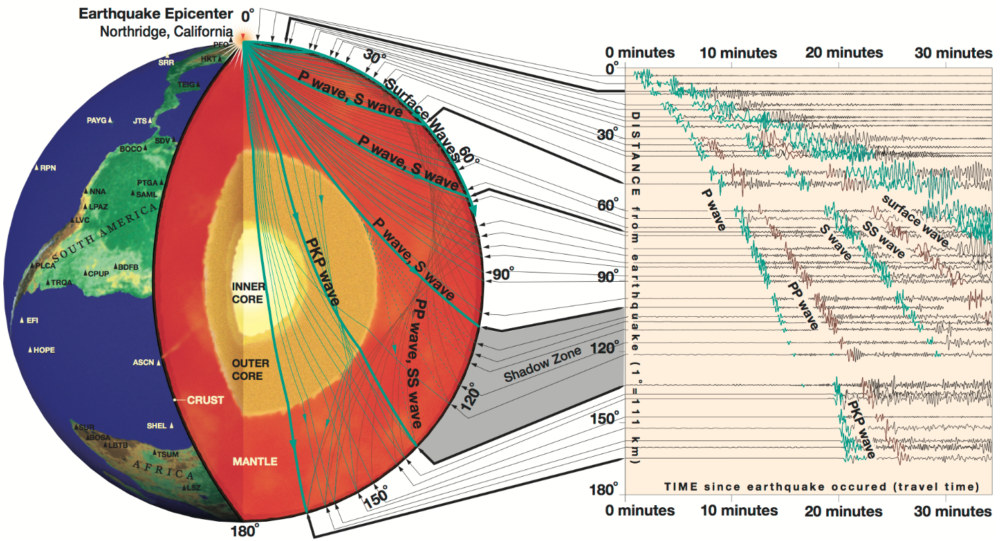

Introduction to Seismology
==========================

Introduction
------------

Keiiti Aki & Paul G. Richards, *Quantitative Seismology: Theory and Methods*:

    **Seismology is a science based on data called seismograms, which are records of mechanical vibrations of the Earth. These vibrations may be caused artificially by man-made explosions, or they may be caused naturally by earthquakes and volcanic eruptions.**

Earthquakes create seismic waves that travel through the Earth. By analyzing these seismic waves, seismologists can explore the Earth's deep interior.

On 1994 Jan. 17, a magnitude 6.9 earthquake near Northridge, California released energy equivalent to almost 2 billion kilograms of high explosive. It created seismic waves that travelled throughout the Earth's interior and were recorded at seismic stations aroung the world. The paths of some of those seismic waves and the ground motion that they caused at various locations are shown below.

   Exploring the Earth Using Seismology (From https://www.iris.edu/hq/inclass/fact-sheet/exploring_earth_using_seismology)

Although the seismic waves are generated together, they travel at different speeds. Shear waves (S waves), for example, travel through the Earth at approximately one-half the speed of compressional waves (P waves). Stations close the earthquake record strong P, S and Surface waves in quick succession just after the earthquake occurred. Stations farther away record the arrival of these waves after a few minutes, and the times between the arrivals are greater.

At about 100 degrees distance from the earthquake, the travel paths of P and S waves start to touch the edge of the Earth's outer core. Beyond this distance, the first arriving wave, i.e., the P wave, decreases in size and then disappears. P waves that travel through the outer are called the PKP waves. They start to appear beyond 140 degrees. The distance between 100 and 140 degrees is often referred to as the "Shadow zone".

We do not see shear (S) waves passing through the outer core. Because liquids can not be sheared, we infer that the outer core is molten. We do, however, see waves that travel through the outer core as P waves, and then transform into S waves as they go through the inner core. Because the inner core does transmit shear energy, we assume it is solid.

Resources
---------

- `Remote Online Sessions for Emerging Seismologists <https://www.iris.edu/hq/inclass/course/roses>`__: a very good seismological course for Ph.D. students
- `seisman's blog <https://blog.seisman.info/>`__: the most popular Chinese blog about seismology

