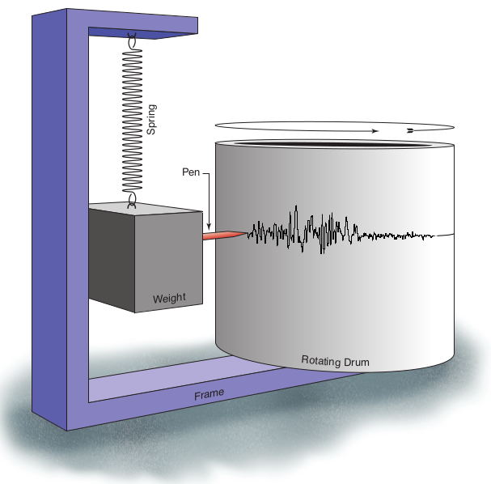
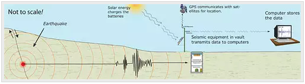
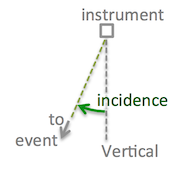

Seismic Station
===============

Seismograph
-----------

A **seismograph** is a device for measuring the movement of the earth, and consists of a ground-motion detection sensor called a **seismometer**, coupled with a recording system called **data logger**. The recorded ground motion is called a **seismogram**.

Seismometers used in earthquake studies are highly sensitive to ground movements, so that movements as small as 1 nanometer (distances almost as small as atomic spacing) can be detected at very quiet sites.

   Illustrations of a Seismometer (From https://www.iris.edu/hq/inclass/fact-sheet/how_does_a_seismometer_work)

When seismic wave arrives at a seismometer, the ground motion is recorded and converted to digital records. These data are transmitted continuously to data processing center by cellular telephone, broadband Internet, or satellite communications systems. They will be made available via the Internet to researchers and the general public.

   How does a seismic station work? (From http://www.usarray.org/public/about/how#anchor1)

Distance and Angles
-------------------

.. figure:: az-baz.png
   :alt: azimuth and back azimuth
   :width: 50.0%
   :align: center

   azimuth and back azimuth (From https://seisman.github.io/SAC_Docs_zh/fileformat/header-variables/#gcarc-dist-az-baz)

- ``great circle arc``: the great circle arc at the Earth's surface from an earthquake to a station
- ``azimuth``: the direction from an earthquake to the station measured clockwise from north
- ``backazimuth``: the direction from the station towards an earthquake. It's 180° off from the azimuth.
- ``incidence angle``: the angle from vertical at which an incoming ray arrives. A ray arriving from directly below the station would have an incidence of 0°.

   incidence angle (From https://service.iris.edu/irisws/rotation/docs/1/help/)

Instrument Response
-------------------

At present, we don't need to know details about the instrument response: (1) it is a little complicated; (2) we don't need it for local tomographic studies.

Some references can be used if the future studies need it.

- `Data and Metadata in the Remote Online Sessions for Emerging Seismologists <https://www.iris.edu/hq/inclass/lesson/705>`__
- `instrument response notes in seisman's blog <https://blog.seisman.info/tags/%E4%BB%AA%E5%99%A8%E5%93%8D%E5%BA%94>`__
- `instrument response in Chinese SAC Documentation <https://seisman.github.io/SAC_Docs_zh/appendix/resp/>`__
- `instrument response in Seismo-Live <https://krischer.github.io/seismo_live_build/html/General%20Seismology/instrument_response_wrapper.html>`__
- `IRIS DMC Library of Nominal Responses for Seismic Instruments <http://ds.iris.edu/NRL/>`__

Other Seismic Instruments
-------------------------

There are also some other seismic instruments which are currently widely used or under development.

- Ocean Bottom Seismometer (OBS)
- Rotational Seismology
- Distributed Acoustic Sensing (DAS)

