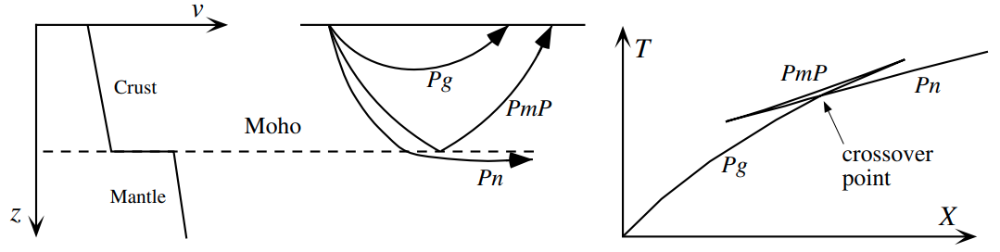
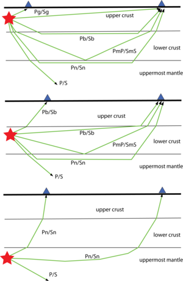

Seismic Phases
==============

- IASPEI (International Association of Seismology and Physics of the Earth's Interior) standard phase list: http://www.isc.ac.uk/standards/phases/
- Phase naming in TauP: https://docs.obspy.org/packages/obspy.taup.html#phase-naming-in-obspy-taup
- Notes about multiple P-phases in TauP: https://blog.seisman.info/taup-identify-multiple-P-phases/

Please note the IASPEI phase naming is a little different from those in TauP. So, you'd better know what you really mean when you use phase names in TauP.

Below show some IASPEI phase definitions (**alt**: acceptable alternative name)

Crustal Phases
--------------

   Ray geometries and names for crustal P phases.

- **Pg**: At short distances, either an upgoing P wave from a source in the upper crust or a P wave bottoming in the upper crust. At larger distances also arrivals caused by multiple P-wave reverberations inside the whole crust with a group velocity around 5.8 km/s.
- **Pb**: (**alt**: P*) Either an upgoing P wave from a source in the lower crust or a P wave bottoming in the lower crust
- **Pn**: Any P wave bottoming in the uppermost mantle or an upgoing P wave from a source in the uppermost mantle
- **PmP**: P reflection from the outer side of the Moho
- **Sg**: At short distances, either an upgoing S wave from a source in the upper crust or an S wave bottoming in the upper crust. At larger distances also arrivals caused by superposition of multiple S-wave reverberations and SV to P and/or P to SV conversions inside the whole crust.
- **Sb**: (**alt**: S*) Either an upgoing S wave from a source in the lower crust or an S wave bottoming in the lower crust
- **Sn**: Any S wave bottoming in the uppermost mantle or an upgoing S wave from a source in the uppermost mantle
- **SmS**: S reflection from the outer side of the Moho

   crustal phases (From http://www.isc.ac.uk/standards/phases/)

Near Source Surface Reflections (Depth Phases)
----------------------------------------------

- **pP**: Reflection of an upgoing P wave at the free surface
- **sP**: Reflection of an upgoing S wave at the free surface

